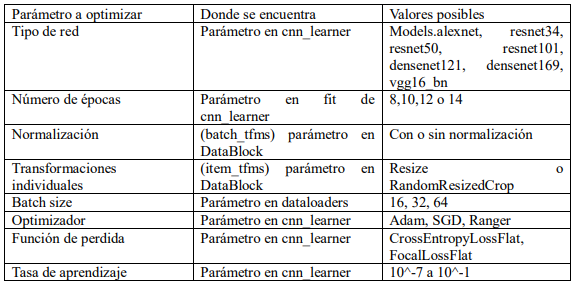

<h1>Documento resumen del proyecto para clasificar imágenes de animales</h1>

<ol>
<h2><li>Resumen del proyecto</li></h2>

Este proyecto consistirá en la creación de un modelo de red neuronal convolucional de Deep Learning para clasificar imágenes de animales. Para ello se utilizará la biblioteca FastAi e imágenes de animales obtenidas mediante scraping. Los tipos de animales a clasificar son el alimoche, el buitre leonado, la cacatúa, la cigüeña, la garza, el loro, el milano negro y el periquito. Este sistema puede tener diferentes finalidades como la detección de especies para monitorear las poblaciones o el reconocimiento de fauna para detectar la presencia de animales. 

<h2><li>Tecnologías utilizadas</li></h2>

Se van a utilizar las siguientes tecnologías relacionadas con Python:

<ul>
<li>Selenium: para hacer scraping y obtener imágenes de los animales</li>
<li>FastAi: para la creación de la red neuronal</li>
</ul>

<h2><li>Proceso realizado</li></h2>

En primer lugar, mediante los scripts de Python adjuntos, se ha hecho scraping para obtener imágenes de cada uno de los tipos de animales a clasificar mediante búsquedas en Google imágenes. Una vez obtenido un amplio banco de imágenes, se ha realizado una pequeña limpieza eliminando las imágenes que podrían no ser adecuadas para la creación del modelo (dibujos, animaciones...). Después se han separado las imágenes en tres conjuntos, un conjunto de entrenamiento, un conjunto de test y un conjunto de validación para crear el modelo y evaluar su precisión. A continuación, se han evaluado diferentes combinaciones de parámetros y opciones para la creación del modelo con el objetivo de aumentar al máximo la precisión. 

<h3>Separación de imágenes</h3>
Finalmente, para cada animal, mediante scraping, se han obtenido entre 120 y 140 imágenes. Estas imágenes para cada animal se han dividido en tres conjuntos. Un conjunto de entrenamiento con alrededor de 85-90 imágenes para cada animal, un conjunto de test con alrededor de 20 imágenes para cada animal y un conjunto de validación con alrededor de 20 imágenes para cada animal también. 

<h3>Parámetros a optimizar</h3>
En la siguiente tabla se detallan los parámetros a optimizar para obtener el modelo que realice las mejores clasificaciones posibles:

Como son muchos los parámetros a optimizar, donde cada campo en muchos casos tiene varios valores posibles, se va a ir optimizando cada parámetro de manera individual e independiente. Esto proporcionará una ligera idea de cuál es el mejor valor para cada parámetro. Con las pruebas iniciales, se ha podido observar que los valores más adecuados para la tasa de aprendizaje se encuentran entre 10^-4 y 10^-3 y respecto al número de épocas el valor más adecuado es 12. El orden con el que se van a optimizar los parámetros es en primer lugar el parámetro asociado a la normalización y transformaciones individuales, después el optimizador, a continuación, la función de perdida y después el batch_size.

<h3>Valores finales de los parámetros</h3>
A continuación, para cada parámetro, se comenta el valor que se ha establecido para crear el modelo final:
<ul>
<li>Tipo de red: alexnet</li>
<li>Numero de épocas: 8</li>
<li>Normalización: Sin normalización</li>
<li>Transformaciones individuales: Resize</li>
<li>Batch_size: 16</li>
<li>Optimizador: Ninguno definido en cnn_learner</li>
<li>Función de perdida: Ninguna definida en cnn_learner</li>
<li>Tasa de aprendizaje: slice(1e-4, 1e-3)</li>
</ul>

<h2><li>Resultado final: vídeo youtube y repositorio</li></h2>
Repositorio Github:

<h2><li>Conclusiones</li></h2>
Con este proyecto, he profundizado en la clasificación de imágenes mediante FastAi y en el ajuste de parámetros. La precisión finalmente obtenida sobre el conjunto de test rondaba 0.81 lo que es un valor bastante adecuado.

</ol>
